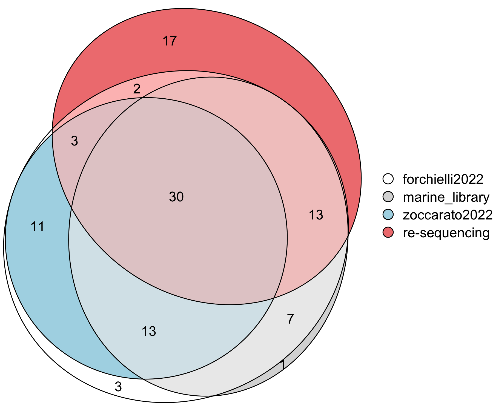

# iamm-collection
This repo is used to consolidate various metadata related to a large portion of the Segrè lab's microbial strains. The majority of this work originated from the HFSP collaboration *Interactions Among Marine Microbes* (IAMM).

The result is a [master metadata file](all_metadata_file.tsv) which should be used as primary point of information on any of the strains covered.

## Master Metadata File Column Structure
 - `ds_strain_id`: This is the unique strain identifier across projects. It stands for "Daniel Segrè lab strain identifier" **This ID must be used for all work related to these strains for consistencies.**
 - `phylum`, `class`, ..., `strain_designation`: Names of Strain at various taxonomic levels
 - `source`, `source_catalog_number`: Where we got the strain from.
 - `id_...`: Project-specific identifiers. See below for specific labels. This value together with the value of column `ds_strain_id` can serve to map between different projects. In addition, presence of a value in these columns indicates that this strain is being used in a particular project.
 - `RES_...`, `LIB_...`, `ZOC_...`: Project-specific metadata, included for convenience. See below for specific labels. 

## Involved Projects
The following projects have in some way dealt with (some) of the strains:
 - `re-sequencing`/`RES`: Re-sequencing of bacteria retrieved from various sources to investigate genome variation.
 - `marine_library`/`LIB`: The Segrè lab library of marine microbial strains covering a wide range of (potential interaction) traits based on /in silico/ analysis by Zoccerato /et al./ (`ZOC`). This is a physical strain library which is in our -80 °C.
 - `forchielli22`/`FOR`: Phenotyping of marine bacteria on single carbon sources. DOI: <https://doi.org/10.1128/msystems.00070-22>
 - `zoccarato22`/`ZOC`: An _in silicon_ study across 473 to identify genome functional clusters (GFCs) grouping strains with similar traits (potentially involved in microbial interactions). DOI: <https://doi.org/10.1038/s42003-022-03184-4>

## Consolidation Process
 - Used [20231026-metadata_merge.R](./20231026-metadata_merge.R) to merge and unify strain metadata of `RES` and `FOR` projects.
   - This used the following metadata files as input:
     - [metafile.csv](./metafile.csv): initial metafile of the `RES` project
     - [strain_tax copy.xlsx](./strain_tax copy.xlsx): `FOR` metadata
   - This created `master_metadata_file.tsv`
 - The metadata from projects `FOR` and `RES` in file `master_metadata_file.tsv` where manually combined, curated and integrated resulting in [20231026-master_metadata_file-curated.xlsx](./20231026-master_metadata_file-curated.xlsx).
 - Used [20231130-consolidation_euler.R](./20231130-consolidation_euler.R) to integrate the curated metadata with `LIB` and `ZOC` project's:
   - This used the following metadata files as input:
     - [20231026-master_metadata_file-curated.xlsx](./20231026-master_metadata_file-curated.xlsx)
     - [20231213-strain_lib.tsv](./20231213-strain_lib.tsv): `LIB` metafile of the marine strain library
       - created initially by Konrad, 2022-11-01 using [20221101-metadata_merge.R](./20221101-metadata_merge.R), curated by hand 2023-12-13
     - [zoccarato2022-....xlsx](./zoccarato2022-a_comparative_whole-genome_approach_identfies_bacterial_traits_for_marine_microbial_interactions.xlsx): `ZOC` metadata
     - [20231205-map-metadata_zoccarrato22.tsv](./20231205-map-metadata_zoccarrato22.tsv): file used for manual mapping to `ZOC` metadata after using heuristics (mapping by Species, Reference-file, Source ID)
   - This creates [all_metadata_file.tsv](./all_metadata_file.tsv) and the Euler diagram below

