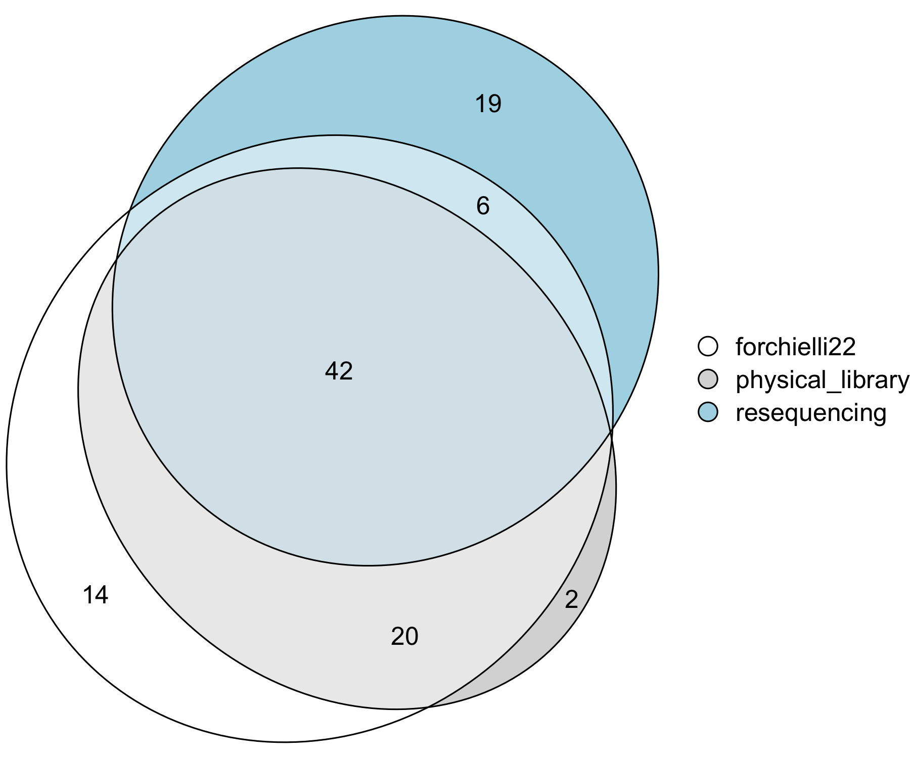

# iamm-collection
This repo is used to consolidate various metadata related to a large portion of the Segrè lab's microbial strains. The majority of this work originated from the HFSP collaboration *Interactions Among Marine Microbes* (IAMM).

The result is a [master metadata file]() which should be used as primary point of information on any of the strains covered.

## Involved projects
The following projects have in some way dealt with (some) of the strains:
 - `resequencing`: Re-sequencing of bacteria retrieved from various sources to investigate genome variation.
 - `forchielli22`: Phenotyping of marine bacteria on single carbon sources.
 - `physical_library`: A library of marine microbial strains covering a wide range of (potential interaction) traits based on /in silico/ analysis by Zoccerato /et al./.

## Consolidation process
 - Used [20231026-metadata_merge.R](./20231026-metadata_merge.R) to merge and unify strain metadata of `resequencing` and `forchielli22` projects.
   - This used the following metadata files as input:
     - [metafile.csv](./metafile.csv): initial metafile of the `resequencing` project
     - [strain_tax copy.xlsx](./strain_tax copy.xlsx): `forchielli22` metadata
   - This creates `master_metadata_file.tsv`
 - The metadata from projects `forchielli22` and `resequencing` in file `master_metadata_file.tsv` where combined, curated and integrated by hand resulting in `20231026-master_metadata_file-curated.xlsx`.
 - Used [20231130-consolidation_euler.R](./20231130-consolidation_euler.R) to integrate the curated metadata with `physical_library`:
   - This used the following metadata files as input:
     - [20231026-master_metadata_file-curated.xlsx](./20231026-master_metadata_file-curated.xlsx)
     - [20221101-strain_lib.tsv](./20221101-strain_lib.tsv): `physical_library` metafile of the physical strain library (in 
-80 °C freezer).
       - created by Konrad, 2022-11-01 using [20221101-metadata_merge.R](./20221101-metadata_merge.R)
   - This creates [all_metadata_file.tsv](./all_metadata_file.tsv) and the Euler diagram below

